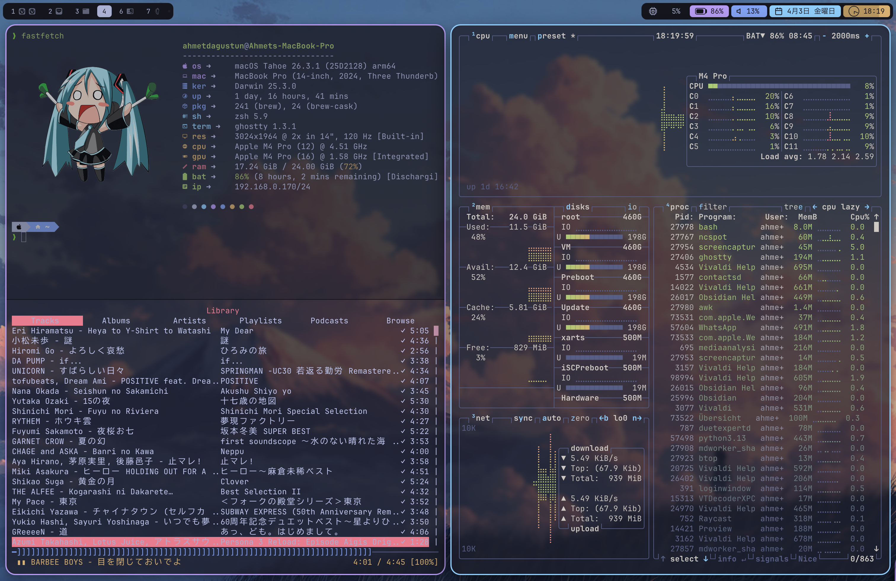

My personal dotfiles, 



## 🛠️ The Stack
* **WM:** [AeroSpace](https://github.com/nikitabobko/AeroSpace) (i3-like tiling for macOS)
* **Terminal:** [Ghostty](https://ghostty.org/)
* **Shell:** Zsh + [Oh My Zsh](https://ohmyz.sh/) + [Powerlevel10k](https://github.com/romkatv/powerlevel10k)
* **Bar:** [Simple-bar](https://github.com/Jean-Tinland/simple-bar)
* **Borders:** [JankyBorders](https://github.com/FelixKratz/JankyBorders) 
* **File Manager:** [Yazi](https://github.com/sxyazi/yazi)

## To bypass restrictions in Turkiye.
* **SpoofDPI-TR:** ([SpoofDPI](https://github.com/renardozt/SpoofDPI-Turkiye))

## ⌨️ Custom Keybindings (Alt = ⌥)
* `Alt + T` ➜ Launch Ghostty
* `Alt + B` ➜ Launch Vivaldi
* `Alt + Shift + Q` ➜ Kill Focused Pane

## 🚀 Quick Setup
1.  **Install Homebrew:** `/bin/bash -c "$(curl -fsSL https://raw.githubusercontent.com/Homebrew/install/HEAD/install.sh)"`
2.  **Clone & Sync:**
    ```bash
    git clone [https://github.com/ahmetdagustun/dotfiles.git](https://github.com/ahmetdagustun/dotfiles.git) ~/dotfiles
    brew bundle --file=~/dotfiles/Brewfile
    chmod +x ~/dotfiles/setup.sh && ./~/dotfiles/setup.sh
    ```

---
*Maintained by Ahmet Dagustun*